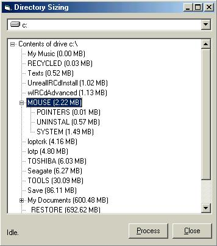



## Directory Sizer v2

### Description

This is version 2 of my directory sizer. This has been brought on by the comments left for the previous submission. Its idea is simple but is useful where by it lists sizes of directories in a Treeview. In this version I fixed a little bug with duplicate keys and have also made the directories sorted by space used.
 
### More Info
 
Drive Control used to get drive letter

Treeview containing directory structure.

             |
---                |---
**Submitted On**   |2002-05-14 09:15:12
**By**             |[Xaiin](https://github.com/Planet-Source-Code/PSCIndex/blob/master/ByAuthor/xaiin.md)
**Level**          |Beginner
**User Rating**    |4.7 (28 globes from 6 users)
**Compatibility**  |VB 5\.0, VB 6\.0
**Category**       |[Files/ File Controls/ Input/ Output](https://github.com/Planet-Source-Code/PSCIndex/blob/master/ByCategory/files-file-controls-input-output__1-3.md)
**World**          |[Visual Basic](https://github.com/Planet-Source-Code/PSCIndex/blob/master/ByWorld/visual-basic.md)
**Archive File**   |[Directory\_828525142002\.zip](https://github.com/Planet-Source-Code/xaiin-directory-sizer-v2__1-34769/archive/master.zip)

